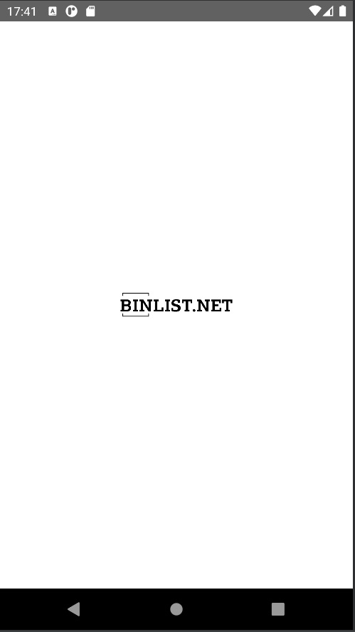
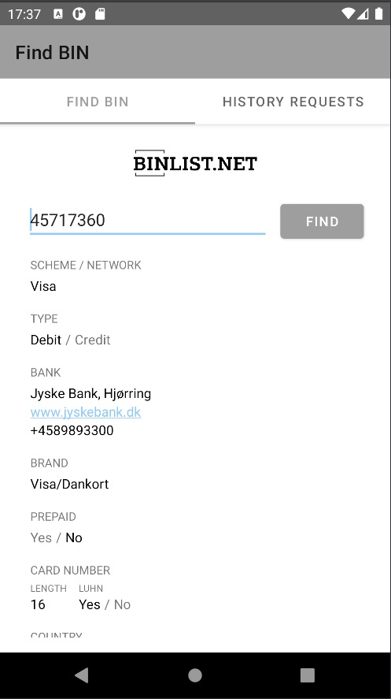
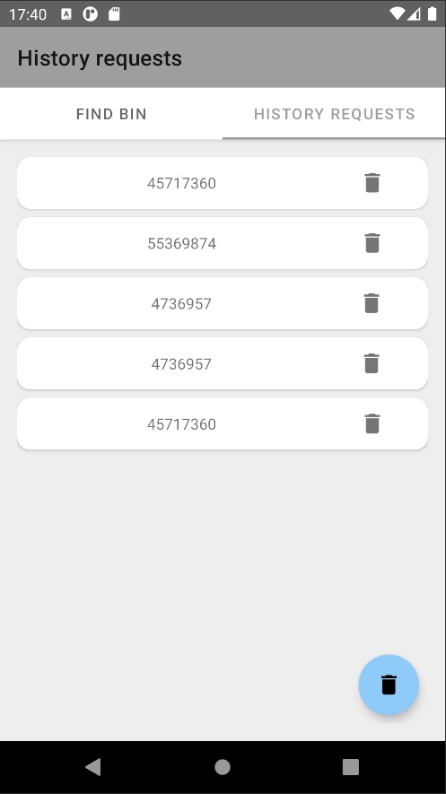

# О приложении
Тестовое задание на стажировку в проект ШИФТ компании ЦФТ (https://team.cft.ru/start/intensive)
---

# Возможности приложения
### 1. Главный экран (FIND BIN)
- на главнм экране отображается полле ввода BIN-номера
- по кнопке FIND выполняется запрос данных с сервера
- при положительном ответе сервера полученные данные отображаются в полях экрана
- при отрицательном ответе сервера отображается тост с ошибкой
- при отсутствии интерената отображается тост с ошибкой
- 
  

### 2. Экран истории запросов (HISTORY REQUESTS)
- все предыдущие запросы отображаются списком от более свежего к более старому
- можно удалить любую запись кнопкой в соотетсвующем запросе
- отчистка истории выполняется по нажатию на FAB в нижней правой части экрана (через диалог подтверждения)

  

---
# Используемые технологии
- Kotlin + Coroutines
- MVVM + Single Activity
- Room
- StateFlow + LiveData
- Jetpack Navigation
- Hilt
- Material IO Components 
